Geodesic
========

Academic research project on Automated Hand Detection with Kinect

**Published at Catalan Association of Artificial Intelligence (CCIA – 2013)**

## Abstract
In the last years, with the appearance of the multi-modal RGB-Depth information provided by the low cost KinectTM sensor, new ways of solving Computer Vision challenges have come and new strategies have been proposed. In this work the main problem is automatic hand detection in multi-modal RGB-Depth visual data. This task involves several difficulties due to the changes in illumination, viewport variations and articulated nature of the human body as well as its high flexibility. In order to solve it the present work proposes an accurate and efficient method based on hypothesis that the hand landmarks remain at a nearly constant geodesic distance from automatically located anatomical reference point. In a given frame, the human body is segmented first in the depth image. Then, a graph representation of the body is built in which the geodesic paths are computed from the reference point. The dense optical flow vectors on the corresponding RGB image are used to reduce ambiguities of the geodesic paths’ connectivity, allowing to eliminate false edges interconnecting different body parts. Finally, as the result, exact coordinates of both hands are obtained without involving costly learning procedures.

### Demo

## Screenshots
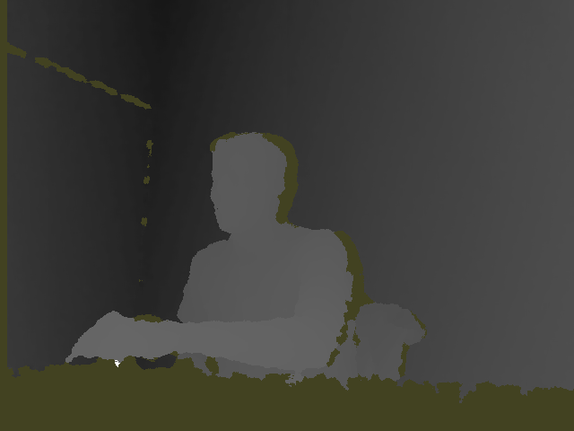
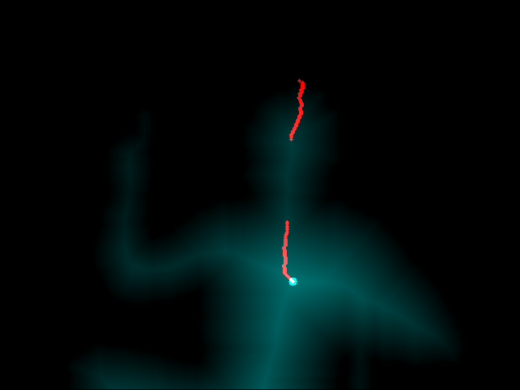
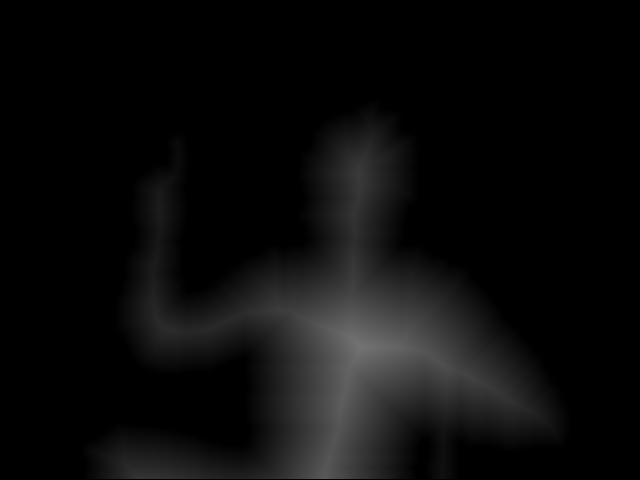
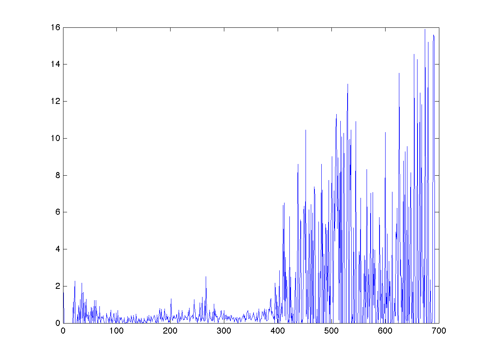

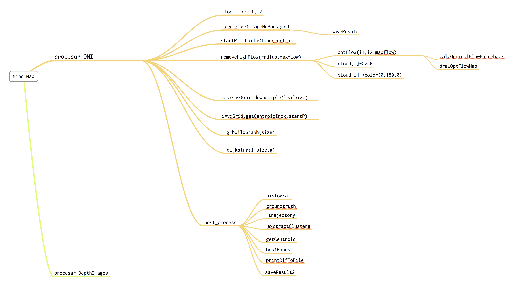
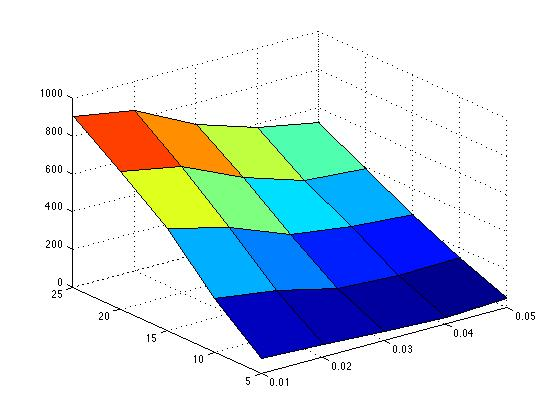
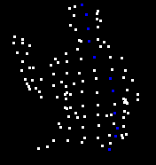
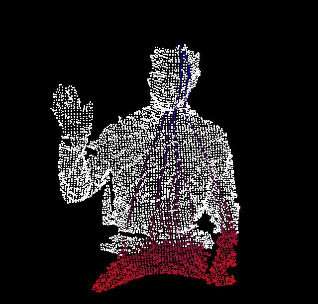
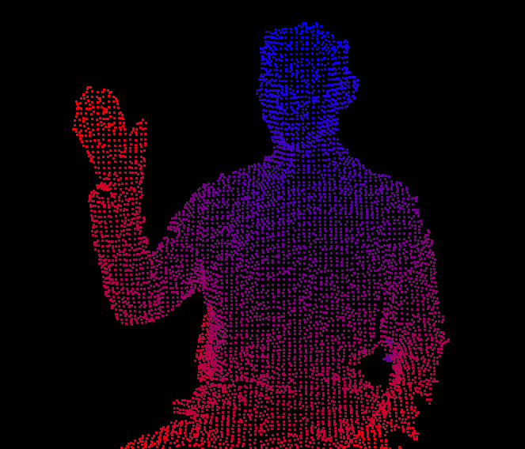
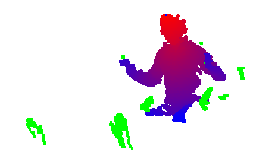
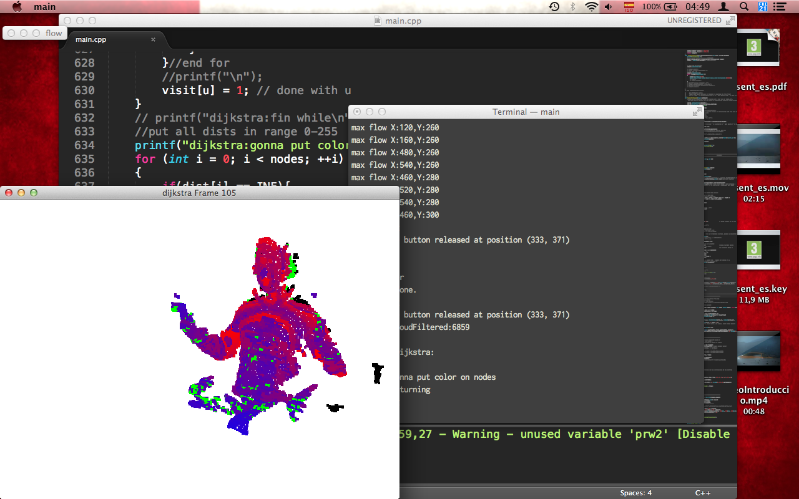
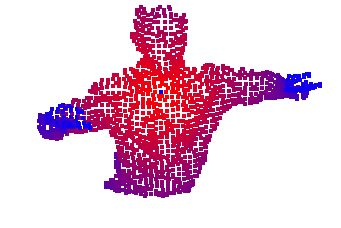
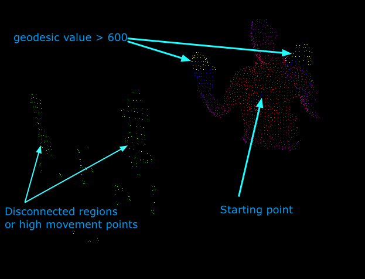

## Dependencies
The project was developed with the next libraries:

- OpenNi 1.5.4.0
- OpenCV
- PCL 1.3

To run the program execute main executable with two parameters: path to image1, path to image2

Full Research Documentation
------------
#### Thesis

Catalan Association of Artificial Intelligence (CCIA – 2013)

https://dblp.org/rec/html/conf/ccia/KonovalovCE13
http://www.maia.ub.es/~sergio/linked/vitaliy_ccia2013.pdf

#### Slides
http://www.maia.ub.es/~sergio/linked/vitaly_ccia_2013.pdf

## License
Documentation materials are licenced under Creative Common License
All the source code files are under GNU GPL v3.0 license. See LICENSE.txt to read more about GNU GPL v3.0 license.
